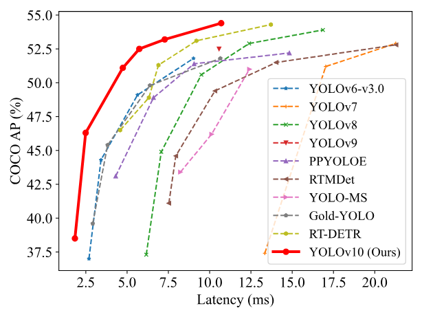
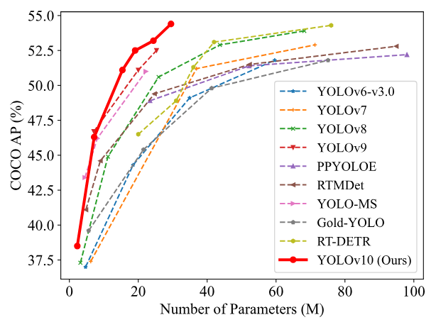

Here's a draft for your README file:

---

# Real-Time People Counting and Queue Monitoring Solution

This project is an inference solution that processes a video file to monitor and raise an alert if more than a specified number of people (e.g., 4) are visible continuously for over 1 minutes. The region to monitor is predefined, and an alert is displayed in the video when the conditions are met.

## Table of Contents
- [Overview](#overview)
- [Tech Stack](#tech-stack)
- [Features](#features)
- [Installation](#installation)
- [Usage](#usage)
- [Approach](#approach)
- [Demo Video](#demo-video)
- [Future Improvements](#future-improvements)

## Overview
This project was built as part of a task to detect overcrowding in a designated area using YOLOv10 for object detection. The goal is to raise an alert if more than a certain number of people are queuing or standing in the region for a prolonged time, exceeding 1 minutes. 

## Tech Stack
- **Python**: Main programming language
- **OpenCV**: For video processing and object detection display
- **YOLOv10**: Pre-trained model for person detection
- **NumPy**: Used for bounding box calculations

## Features
- Detects and tracks the number of people in a specified region (ROI) of the video using YOLOv10.
- Raises an alert if the count exceeds a threshold (e.g., 3 people) for more than 1 minutes.
- Provides visual feedback with bounding boxes around detected people and the elapsed time of detection.
- Handles missed detections by allowing a tolerance of up to 60 frames before resetting the detection count.

## Installation
1. **Clone the repository**:
   ```bash
   git clone <repository-link>
   cd <repository-folder>
   ```

2. **Install dependencies**:
   Use `pip` to install the required packages:
   ```bash
   pip install -r requirements.txt
   ```

## Usage

1. Store the input video in the `input_video` folder and create an `output_video` folder to store the processed video output. You can get the video from [Google Drive](https://drive.google.com/drive/u/0/folders/1HMZxilX-Lj1L98zcmCQdgn63DamctI3j).

    Original Video link: [Youtube](https://www.youtube.com/watch?v=KMJS66jBtVQ)

2. **Running the Script**:
   You can run the script on a video file as follows:
   ```bash
   python people_tracking.py
   ```

3. **Output Video**:
   The output will be saved to the specified location as a video with bounding boxes and alerts:
   ```python
   output_video_path = 'output_video/tracked_output.mp4'
   ```

## Approach
1. **Person Detection**:
   YOLOv10, developed with the Ultralytics Python package by Tsinghua University researchers, enhances real-time object detection by improving model architecture and eliminating non-maximum suppression (NMS). It offers significantly better performance than previous YOLO versions, which is why we chose this model. Comprehensive experiments show its superior accuracy-latency balance across different model sizes.


|  | |
|-------|-------------|
|  |  |

 Comparison with others in terms of latency-accuracy (left) and size-accuracy (right) [source](https://github.com/THU-MIG/yolov10)

2. **Region of Interest (ROI)**:
    A specific region of interest (ROI) is defined within the video, and only people detected in this region are considered for counting.

3. **Counting & Alert**:
   - The script counts people whose bounding boxes overlap with the ROI by more than 50% to ensure accurate counting.
   - If the number of people in the ROI exceeds a set threshold (e.g., 4) for more than 1 minutes (60 seconds), an alert message is displayed.
   - Missed detections are tolerated for up to 2 seconds to account for momentary occlusions or detection inaccuracies.

4. **Alert Display**:
   If an alert condition is met, a blinking warning message is shown in the video output indicating that the queue has been too long.

## Demo Video
[Link to demo video](https://drive.google.com/file/d/1dUhD7yH-6PXDIVB95K_kHR9p8SiSk1ZE/view?usp=sharing)

